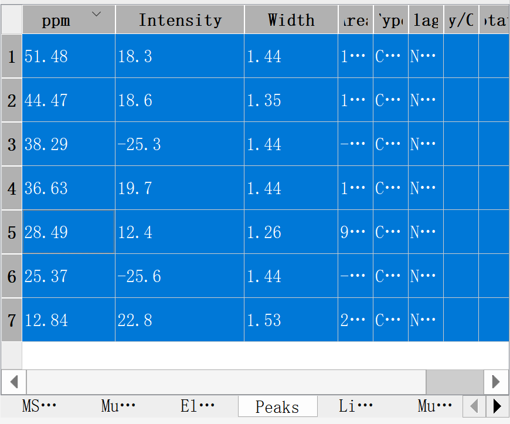

# NMR Report Tools
Several simple tools to aid the reporting of NMR data.

[Download here](https://github.com/liyuanhe211/NMR_Report_Tools/releases/download/1.0/NMR_Report_Tools.zip).

## Convert 13C-NMR 2-digits to 1-digit
Copy comma-separated floating point numbers to the clipboard:

For example, copy:
```
53.57, 53.30, 44.48, 44.46, 38.57, 36.62
```
Then immediately paste to get:
```
53.6, 53.3, 44.5 (44.48), 44.5 (44.46), 38.6, 36.6
```
Screen recording demo:
##
https://user-images.githubusercontent.com/18537705/224800191-9c15299b-ec82-41e1-810d-22398b9c08da.mp4
##

## NMR DEPT Report

Copy a MestReNova peak table:

<p align="center"></img></p>

(What's in the clipboard is):

```
	ppm	Intensity	Width	Area	Type	Flags	Impurity/Compound	Annotation
1	51.48	18.3	1.44	166.20	Compound	None		
2	44.47	18.6	1.35	155.29	Compound	None		
3	38.29	-25.3	1.44	-219.82	Compound	None		
4	36.63	19.7	1.44	182.06	Compound	None		
5	28.49	12.4	1.26	99.06	Compound	None		
6	25.37	-25.6	1.44	-243.66	Compound	None		
7	12.84	22.8	1.53	233.09	Compound	None			
```

And the program will save the following report to clipboard:
```
51.48 (+), 44.47 (+), 38.29 (-), 36.63 (+), 28.49 (+), 25.37 (-), 12.84 (+)
```
All peaks that labelled not compound are not shown.

Screen recording demo:
##
https://user-images.githubusercontent.com/18537705/224800527-4e098222-1963-49c8-b89c-791148072fa1.mp4
##


## Count hydrogen from NMR report:

To verify that the total number of hydrogens are correct. (Note that this is easier to achieve in MestReNova itself.)

Paste the following report to the CMD window:

```
δ 9.41 (s, 1H), 2.21 (d, J = 17.1 Hz, 1H), 1.90 (d, J = 7.8 Hz, 2H), 1.88 – 1.83 (m, 1H), 1.87 – 1.76 (m, 2H), 1.63 (s, 3H), 1.56 (s, 3H), 1.52 – 1.41 (m, 2H), 0.80 (t, J = 7.6 Hz, 3H) ppm. 
```
Get 18.

